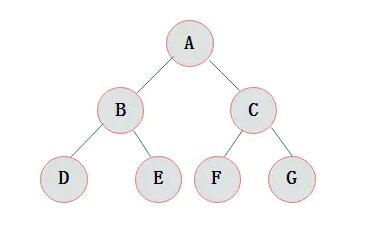

# 二叉树的相关的知识
首先，我们学习一下树结构<br>
在数据结构中的树，相对于现实中的树来说，只是倒立起来而已<br>
我们会有一个根节点，紧接着会衍生很多子节点<br>
你看下面的图是不是很像一课倒立的树呢，A节点就像那个与地面相连的主干？<br>
<br>

### 树-名词解释
有以下名词需要进行解释：<br>
树、空树、子树<br>
节点<br>
双亲结点、孩子节点、兄弟节点、叶子节点<br>
度<br>
层次、深度<br>

ABCDEFG这些就是 **节点**，结点是数据结构中的基础，是构成复杂数据结构的基本组成单位。<br>
A节点就是BC节点的双亲结点/父节点，BC节点就是A节点的孩子节点<br>
DEFG不是双亲节点，没有孩子节点，也被称为叶子节点<br>
一个节点的度，指的就是这个节点的子节点数，比如B节点的度是2<br>
节点的层次，从根开始定义起，根为第一层，根的孩子为第二层，以此类推<br>
树的深度，树中结点的最大层次数称为树的深度或高度，也可以理解为从根节点到最远叶节点间的节点个数，对于上面的ABCDEFG树而言深度是3<br>

### 二叉树-名词解释
<br>
<br>
<br>
<br>
<br>
<br>
<br>
<br>
<br>
<br>
<br>
<br>
<br>
<br>
<br>
<br>

```puml
a -> b: 123
b -> c
c -> a
```


| 网站 | 用户名 | 密码 |
| --- | --- | --- |
| Oracle | 1637177518@qq.com | Zxcvbnmwxh7 |

